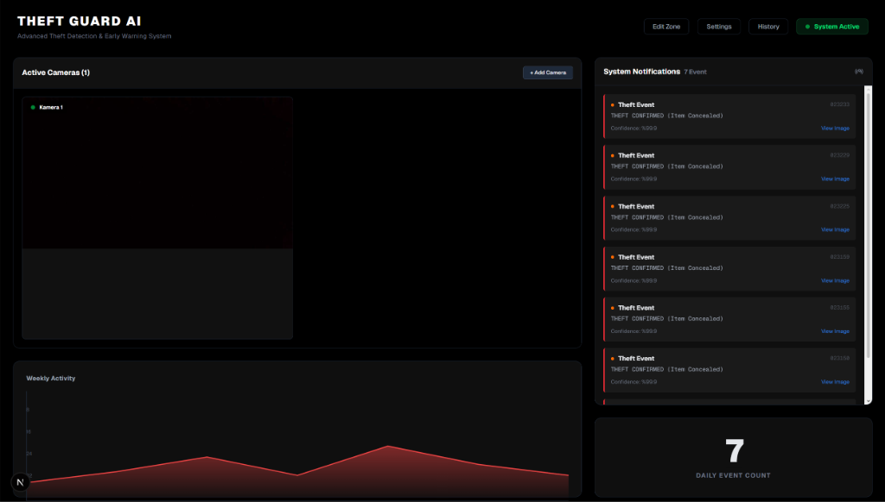
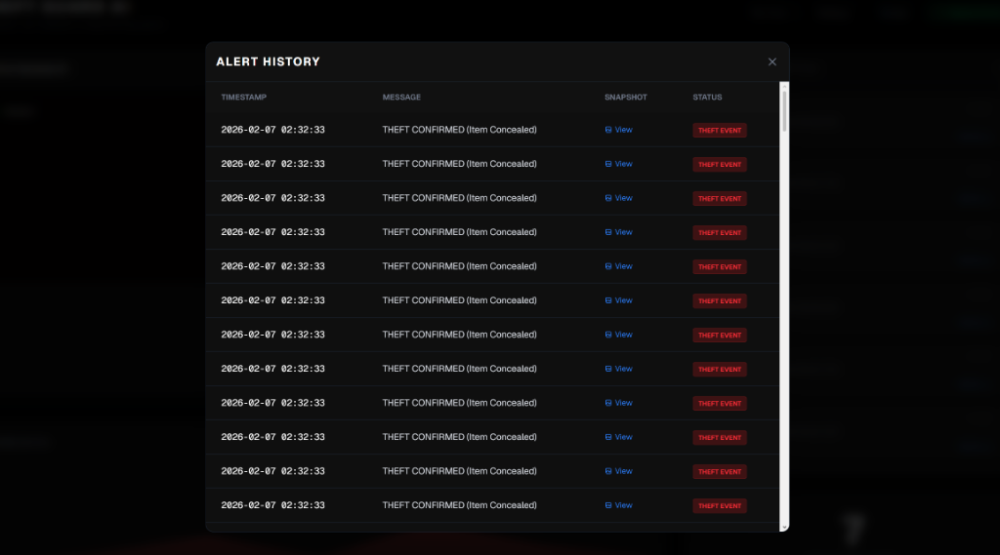
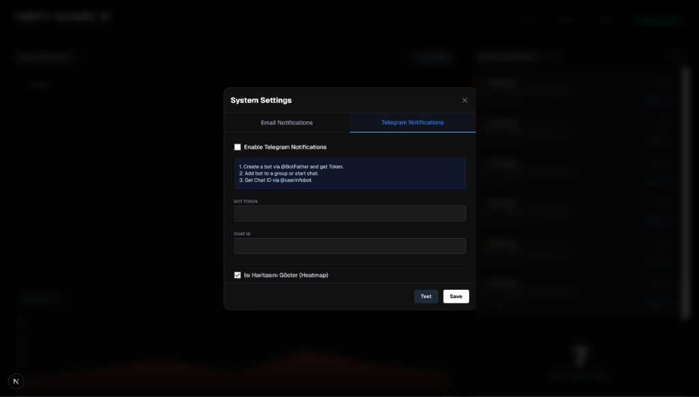
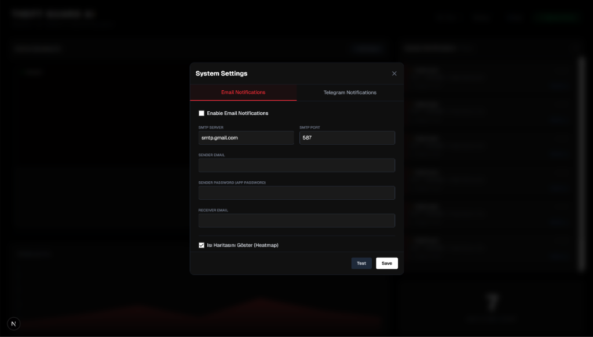

# Theft Guard AI - Advanced Anti-Theft System

Theft Guard AI is a comprehensive security solution designed for retail environments. It leverages Computer Vision and Artificial Intelligence to detect suspicious behaviors such as shoplifting, fighting, and item concealment in real-time. The system processes video feeds from multiple CCTV cameras and provides instant alerts to security personnel via a modern web dashboard, Email, and Telegram.

## System Capabilities

### 1. Advanced Theft Detection
The core of the system is built on a multi-stage AI pipeline that runs locally:
*   **Object Detection:** Utilizes optimized YOLOv8 models to identify person and retail objects. It can be extended with specialized models ('shoplifting.pt') to directly detect theft actions.
*   **Behavior Analysis:** Tracks the movement of hands relative to pockets/bags to detect concealment attempts (Hand-to-Pocket gestures).
*   **Pose Estimation:** Analyzes human skeleton points to detect suspicious postures, such as bending down in aisles or reaching into restricted areas.

### 2. Facial Recognition System
*   **Blacklist Monitoring:** Instantly identifies known offenders entered into the system database and triggers high-priority alerts.
*   **VIP Detection:** Can be configured to recognize loyal customers or VIPs for personalized service.


### 3. Real-Time Surveillance Dashboard

built with Next.js, the dashboard offers a centralized control room experience:
*   **Live Video Feeds:** Stream vertically or horizontally from multiple camera sources (USB or IP Cameras) simultaneously via WebSockets.
*   **Dynamic Graphs:** Visualizes weekly and daily alert statistics to track security trends over time.
*   **Visual Alerts:** Flashing on-screen notifications highlight the camera and timestamp of any detected event.


### 4. Alert History & Evidence


*   **Event Logging:** Every detection is saved to a local SQLite database with a timestamp, alert type, and snapshot path.
*   **Snapshot Capture:** JPEG images of the event are automatically saved to the `alerts/` directory for evidence.
*   **History Viewer:** Browse past alerts and view snapshots directly from the interface.


### 5. Remote Notifications
Stay informed even when away from the desk:
*   **Telegram Integration:** Sends an instant photo and caption to a specified Telegram Chat ID via Bot API.

*   **Email Reports:** Dispatches detailed text alerts to configured email addresses using SMTP.


### 6. Customizable Security Zones

*   **Region of Interest (ROI):** Users can draw custom polygons on the camera feed to define sensitive areas (e.g., cash registers, high-value shelves).
*   **Zone-Specific Triggers:** Loitering and reaching detections are only fired when a person is inside a defined ROI polygon.


## Technical Architecture

*   **Backend:** Python, FastAPI, OpenCV, Ultralytics YOLOv8, Face Recognition, LAPX
*   **Frontend:** Next.js 14, React, Tailwind CSS, Recharts, Lucide React
*   **Database:** SQLite (Lightweight, local storage for events and faces)
*   **Communication:** WebSockets (Real-time data), SMTP (Email), HTTPS (Telegram API)

## Installation Guide

### Prerequisites

| Requirement | Version | Notes |
| --- | --- | --- |
| Python | 3.9+ | [python.org](https://www.python.org/downloads/) — check "Add Python to PATH" on Windows |
| Node.js | 18.17.0 LTS+ | [nodejs.org](https://nodejs.org/) |
| NVIDIA GPU + CUDA | Optional | CPU works but is slower for real-time streams |

> **Windows only — `face_recognition` requires `dlib`**, which needs Visual Studio C++ Build Tools.
> Download from [visualstudio.microsoft.com/visual-cpp-build-tools](https://visualstudio.microsoft.com/visual-cpp-build-tools/) and install before running `pip install`.

---

### 1. Clone the repository

```bash
git clone https://github.com/D3stinn3/theftDetector.git
cd theftDetector
```

### 2. Install Python dependencies

```bash
pip install -r requirements.txt
```

### 3. Configure camera sources

`settings.json` is not included in the repository (it contains credentials). Copy the example file and edit it with your camera details:

```bash
# Windows
copy settings.example.json settings.json

# macOS / Linux
cp settings.example.json settings.json
```

Edit `settings.json` and replace the `cameraSources` entries with your RTSP URLs or USB camera indices (`"0"`, `"1"`, etc.).

### 4. Configure the frontend environment

```bash
# Windows
copy dashboard\.env.example dashboard\.env.local

# macOS / Linux
cp dashboard/.env.example dashboard/.env.local
```

If your backend runs on a different host or port, edit `NEXT_PUBLIC_API_URL` in `dashboard/.env.local` accordingly.

### 5. Install frontend dependencies

```bash
cd dashboard
npm install
cd ..
```

### 6. (Optional) Specialized detection model

If you have a `shoplifting.pt` model, place it in the project root directory. The system will use it automatically. Without it, the system falls back to standard YOLOv8 with behaviour-based detection logic.

---

## Usage

### Quick Start (recommended)

**Windows:**

```bat
start_system.bat
```

**macOS / Linux:**
```bash
chmod +x start_system.sh
./start_system.sh
```

Both scripts:

* Check Python and Node.js are installed
* Auto-create `settings.json` and `.env.local` from examples if missing
* Auto-install frontend dependencies if `node_modules` is absent
* Wait for each service to be healthy before opening the browser
* Print a clear error message if anything fails to start

### Manual Startup

**Backend:**
```bash
# Windows
py backend.py

# macOS / Linux
python3 backend.py
```

**Frontend** (in a separate terminal):
```bash
cd dashboard
npm run dev
```

Open your browser and navigate to `http://localhost:3000`.

### API Health Check

The backend exposes a health endpoint you can use to verify it is running:

```bash
curl http://127.0.0.1:8000/health
# → {"status": "ok"}
```

## Contributing 

1. Fork this repository.
2. Create a feature branch ( `git checkout -b feature/NewFeature` ).
3. Commit your changes ( `git commit -m 'Add new feature'` ).
4. Push to the branch ( `git push origin feature/NewFeature` ).
5. Open a Pull Request.

## License 

Distributed under the MIT License. See `LICENSE` for more information.
